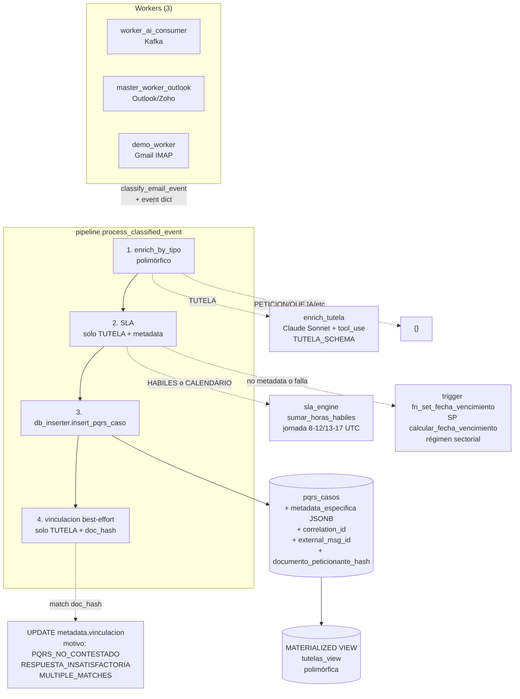

# Sprint Tutelas S1+S2+S3 — Documento Final

**Fecha de cierre:** 2026-04-27
**Branch:** `develop`
**Sesiones ejecutadas:** 3 (S1: DB + migraciones, S2: Backend Python + AI/Worker, S3: QA + Docs + Infra).
**Documentos relacionados:**
- [[SPRINT_TUTELAS_PIPELINE_PROMPT]] (v3 canónico)
- [[SPRINT_TUTELAS_S123_PROGRESS]]
- [[SPRINT_TUTELAS_S123_DIAG_PROD_READONLY]]
- [[SPRINT_TUTELAS_S123_ANALISIS_DRIFT]]
- [[SPRINT_TUTELAS_S123_BLOQUEANTE_DRIFT_REPO]]
- [[SPRINT_TUTELAS_S123_BASELINE_PROD_SCHEMA]]
- [[SPRINT_TUTELAS_S123_STAGING_REBUILD]]
- [[SPRINT_TUTELAS_S123_AG1_DIAGNOSTICO]] · [[SPRINT_TUTELAS_S123_AG1_APLICACION]]
- [[SPRINT_TUTELAS_S123_AG2_DIAGNOSTICO]] · [[SPRINT_TUTELAS_S123_AG2_APLICACION]]
- [[SPRINT_TUTELAS_S123_AG3_DIAGNOSTICO]] · [[SPRINT_TUTELAS_S123_AG3_APLICACION]]
- [[SPRINT_TUTELAS_S123_AG4_QA]]
- [[SPRINT_TUTELAS_S123_SMOKE_E2E]]

## Objetivo

Habilitar el procesamiento end-to-end de **acciones de tutela** dentro del sistema PQRS:
- Detección polimórfica del tipo TUTELA en el pipeline.
- Extracción estructurada con Claude Sonnet (tool_use) — plazo, expediente, accionante, medidas provisionales.
- Cálculo de SLA específico para tutela (HABILES o CALENDARIO) con motor Python que coexiste con el SP sectorial existente.
- Vinculación automática tutela → PQRS-previo del mismo accionante (cross-tenant safe via salt + hash).
- Capabilities granulares por usuario (CAN_SIGN_DOCUMENT, CAN_APPROVE_RESPONSE) con scope TUTELA.
- Vista materializada `tutelas_view` polimórfica para consumo de frontend/BI.

## Alcance

| En alcance | Fuera de alcance |
|---|---|
| 5 migraciones DB (18, 19, 20, 21, 22) | UI frontend de tutelas |
| 4 módulos Python nuevos + extensión 2 existentes | Deploy a producción (sigue bloqueado, ver "Pendiente para prod") |
| 3 fixtures sintéticos `SYNTHETIC_FIXTURE_V1` | Firma digital |
| 3 workers integrados al pipeline unificado | Tracking post-informe |
| Suite de 103 tests local + 4 ARC regression real | Notificaciones push tutela |
| Smoke E2E real contra Claude + staging DB | Migración 14 sectorial a prod (sprint separado) |

## Cadencia ejecutada

| Sesión | Agentes | Duración estimada | Estado |
|---|---|---|---|
| **S1** | Gate 0.5 + Agente 1 (DB) | 4-5 h | ✅ |
| **S2** | Agentes 2 (Backend) + 3 (AI/Worker) + smoke E2E real | 9-11 h | ✅ |
| **S3** | Agentes 4 (QA) + 5 (Docs) + 6 (Infra) | 5-7 h | en progreso |

## Diagrama del pipeline polimórfico



## Decisiones arquitectónicas clave

### B2 — SLA: motor Python coexiste con SP

Decisión: el SP `calcular_fecha_vencimiento` (migración 14) sigue siendo el **default** para todos los tipos de caso, calculado por el trigger `fn_set_fecha_vencimiento` al INSERT.

Para TUTELA con metadata utilizable (`plazo_informe_horas` + `plazo_tipo` extraídos por Claude), el `pipeline` invoca `sla_engine.calcular_vencimiento_tutela` **antes** del INSERT y pasa `fecha_vencimiento` ya calculada al `db_inserter`. El trigger respeta el valor entrante (no sobreescribe).

**Por qué coexisten:** la lógica de horas hábiles intra-día (8-12 + 13-17 UTC + festivos) es compleja en PL/pgSQL. Python con `sla_engine` hace el cálculo en O(N) sobre minutos disponibles, fácil de testear (16 unit tests). El SP queda como fallback defensivo: si el pipeline Python falla, el trigger sigue calculando con régimen sectorial default.

Defense-in-depth en el trigger híbrido `fn_set_fecha_vencimiento` (migración 19):
1. Si `NEW.fecha_vencimiento IS NOT NULL` → respeta (pipeline Python ya calculó).
2. Si `NEW.tipo_caso = 'TUTELA' AND metadata.plazo_tipo = 'CALENDARIO'` → calcula `fecha_recibido + N hours`.
3. Fallback al SP sectorial.

### W3 — Pipeline unificador + auto-registro de enrichers

Antes del sprint, los 3 workers tenían INSERTs manuales con lógica duplicada. El sprint introdujo `pipeline.process_classified_event(clasificacion, event, cliente_id, conn, pool)` que orquesta enrich → SLA → INSERT → vinculación.

Cada enricher (hoy solo `tutela_extractor`) se auto-registra al importarse:
```python
ENRICHERS["TUTELA"] = enrich_tutela
```

`enrich_by_tipo(tipo_caso, event, clasif)` despacha al enricher correspondiente. Si no hay registro, retorna `{}`. Si lanza, retorna `{"_enrichment_failed": True}`. **El pipeline no crashea por bugs de enrichers**.

### Defense-in-depth en propagación de campos

Ante el smoke E2E del Agente 3, se descubrieron bugs latentes (ver "Bugs descubiertos"). El fix consolidó la propagación end-to-end de campos críticos:
- `correlation_id` (mig 22) — trazabilidad Kafka → caso.
- `external_msg_id` — dedup vía `idx_casos_external_msg` UNIQUE parcial.
- `documento_peticionante_hash` — cross-tenant safe + indexado para vinculación.

## Schema completo de `metadata_especifica` para tutelas

JSONB persistido en `pqrs_casos.metadata_especifica` cuando `tipo_caso = 'TUTELA'`:

```json
{
  "tipo_actuacion": "AUTO_ADMISORIO | AUTO_INADMISORIO | FALLO_PRIMERA | FALLO_SEGUNDA | REQUERIMIENTO | NOTIFICACION_CUMPLIMIENTO | OTRO",
  "fecha_auto": "2026-04-27",
  "numero_expediente": "11001-9999-888-2026-00999-00",
  "despacho": {
    "nombre": "Juzgado Tres Penal Municipal",
    "ciudad": "Bogotá D.C."
  },
  "plazo_informe_horas": 16,
  "plazo_tipo": "HABILES | CALENDARIO",
  "medidas_provisionales": [
    {
      "descripcion": "Entrega de medicamentos de alto costo",
      "plazo_horas": 24,
      "plazo_tipo": "CALENDARIO",
      "fecha_auto": "2026-04-27"
    }
  ],
  "accionante": {
    "documento_hash": "<sha256 hex de salt:documento_raw, 64 chars>",
    "tipo_documento": "CC | TI | NIT | CE | PA"
  },
  "accionado": {
    "nombre": "...",
    "nit_hash": "<sha256 hex>"
  },
  "derechos_invocados": ["derecho de petición", "salud"],
  "hechos": ["..."],
  "pretensiones": ["..."],
  "sentido_fallo": "CONCEDIDA | NEGADA | PARCIAL | IMPUGNADA | N/A",
  "_confidence": {
    "plazo_informe_horas": 0.98,
    "numero_expediente": 1.0,
    "tipo_actuacion": 0.95
  },
  "_synthetic_fixture": "SYNTHETIC_FIXTURE_V1",
  "_requiere_revision_humana": false,
  "_extraction_failed": false,
  "vinculacion": {
    "ventana_dias": 30,
    "encontrado_at": "2026-04-27T15:00:00+00:00",
    "motivo": "PQRS_NO_CONTESTADO | RESPUESTA_INSATISFACTORIA | MULTIPLE_MATCHES",
    "matches_ids": ["<uuid>", ...]
  }
}
```

**Reglas:**
- `documento_raw` y `nit_raw` se hashean con `salt = clientes_tenant.config_hash_salt` y se borran antes de persistir.
- `_confidence.plazo_informe_horas < 0.85` → `_requiere_revision_humana = true`.
- `_extraction_failed = true` → defaults defensivos (48h HABILES, AUTO_ADMISORIO) + `_requiere_revision_humana`.
- `_synthetic_fixture` solo aparece si el body contiene el marker `SYNTHETIC_FIXTURE_V1` (warn si en prod).

## 3 fixtures sintéticos (DT-18)

`backend/tests/fixtures/tutelas/`:

| Fixture | Caso de prueba | Confidence esperado |
|---|---|---|
| `01_auto_admisorio_simple.txt` | Plazo HABILES estándar `"dos (2) días hábiles"` | Alto (≥0.85), patrón canónico |
| `02_auto_con_medida_provisional.txt` | Plazo informe ambiguo + medida provisional 24h CALENDARIO | Bajo (<0.85), flag `_requiere_revision_humana` |
| `03_fallo_primera_instancia.txt` | `tipo_actuacion=FALLO_PRIMERA`, sin plazo de informe | Bajo en `plazo_informe_horas` (no aplica), schema lo tolera |

**Plantilla mensaje a Paola Lombana (DT-18 ACTIVA):**

> Hola Paola,
>
> Para el sprint Tutelas necesitamos validar la precisión del extractor IA con oficios reales (no sintéticos). ¿Podrías compartir 5-10 PDFs de oficios judiciales que ARC ya recibió y respondió?
>
> Ideal: variedad — auto admisorio simple, con medida provisional, fallo primera/segunda instancia, requerimientos. Sin nombres ni cédulas (las cubrimos con ☒).
>
> Los uso solo localmente, no se persisten en ningún lado. Te envío el reporte de precisión por cada uno: qué extrajo bien, qué falló, qué confidence dio.
>
> Plazo sugerido: en lo que tengas tiempo, sin presión.

## Caso smoke real — `0f83ce56-7f9c-4209-ba3d-2a5be8ef33ae`

Caso retenido en staging para tests de integración futuros. **NO ELIMINAR sin verificar que no rompe `test_arc_smoke_case_persiste`.**

```
id                          = 0f83ce56-7f9c-4209-ba3d-2a5be8ef33ae
asunto                      = [SMOKE_TEST_AGENTE3] Tutela sintética Agente 3 471586e1-...
tipo_caso                   = TUTELA
fecha_recibido              = 2026-04-27 15:00:53+00
fecha_vencimiento           = 2026-04-29 15:01:00+00 (sla_engine: lun 15:00 + 16h hábiles)
semaforo_sla                = VERDE
correlation_id              = 471586e1-2bce-4c2f-86ca-72d75f877318
external_msg_id             = SMOKE_AGENTE3_471586e1-...
documento_peticionante_hash = 3c4302b3169a4247471a91afe869571bf37aad606298196bbe12eadf304fadd9

metadata_especifica:
  tipo_actuacion          = AUTO_ADMISORIO
  plazo_informe_horas     = 16
  plazo_tipo              = HABILES
  numero_expediente       = 11001-9999-888-2026-00999-00
  _confidence             = {plazo_informe_horas: 0.98, numero_expediente: 1.0, tipo_actuacion: 0.95}
  accionante.documento_hash = 3c4302b3169a4247...
  _synthetic_fixture      = SYNTHETIC_FIXTURE_V1
```

Generado por la 1 call real a Claude Sonnet del Agente 3. La columna física `documento_peticionante_hash` coincide exactamente con `metadata.accionante.documento_hash` — contrato preservado.

## Bugs descubiertos y fixeados durante el sprint

| # | Bug | Detectado en | Fix |
|---|---|---|---|
| 1 | `sumar_horas_habiles` no respetaba el almuerzo (sumar 8h desde 08:00 daba 16:00, no 17:00) | Tests Agente 2 | `_minutos_restantes_bloque` retorna minutos del bloque actual, no del día. Cursor avanza por bloques 08-12 / 13-17. |
| 2 | `_parse_fecha` dependía dura de pandas (no instalado en env local) → fechas ISO caían a `now()` | Tests Agente 2 | `datetime.fromisoformat` como primary path, pandas fallback. |
| 3 | `correlation_id` referenciado en `db_inserter` y `models.py` pero **no existe en prod** | Smoke E2E #1 (Agente 3) | Migración 22 agrega columna NOT NULL DEFAULT gen_random_uuid() + índice. |
| 4 | `external_msg_id` no se propagaba al INSERT del pipeline (workers manualmente lo pasaban antes; al unificar al pipeline se perdió) | Smoke E2E #2 + auditoría sistemática drift | `db_inserter` lee del event con fallback `external_msg_id → message_id → id` y lo pasa como `$14`. |
| 5 | `documento_peticionante_hash` columna física siempre NULL; el extractor solo lo guardaba en metadata JSONB | Auditoría sistemática drift (no detectado por smoke porque `vincular_con_pqrs_previo` devolvía None silenciosamente sin matches) | `db_inserter` extrae de `metadata_especifica.accionante.documento_hash` y lo pasa como `$15`. Habilita query indexada `idx_casos_doc_hash`. |

Los bugs 1 y 2 los detectó el modelo de dev durante implementación. Los bugs 3-5 los detectó el smoke E2E + la auditoría sistemática drift ORM/DB/INSERT — ejemplo claro del valor de tener un smoke real contra DB real, no solo tests con mocks.

## Cobertura del sprint

Tabla orientativa por casos cubiertos. **Pendiente medición numérica formal con `coverage.py` desde el container del Agente 6** (env local cuelga por DT-29 storage_engine eager import).

| Módulo | Tests | Estimación |
|---|---|---|
| `sla_engine.py` | 16 unit + integración | 90%+ |
| `capabilities.py` | 8 unit + isolation | 95%+ |
| `scoring_engine.py` (nueva sección semáforo) | 12 unit | 100% del nuevo |
| `pipeline.py` | 6 unit + 6 E2E + burst + 12 no-regresión | 90%+ |
| `enrichers/__init__.py` + `tutela_extractor.py` | 10 unit + E2E + smoke real | 85%+ |
| `vinculacion.py` | 6 unit + 7 isolation + E2E | 95%+ |
| `db_inserter.py` (cambios sprint) | 9 unit nuevos + 6 E2E + 12 no-regresión | 95%+ del nuevo |

**Total tests del sprint:** 103 local (`--noconftest`) + 4 ARC regression real = **107 tests verdes**.

## Lecciones aprendidas

1. **El smoke real con DB real vale lo que cuesta.** Detectó 3 bugs (correlation_id, external_msg_id, doc_hash) que ningún test unitario con mocks podía ver. La auditoría sistemática drift ORM/DB/INSERT debería ser parte de cualquier sprint que toque schema.

2. **El ORM `models.py` es decorativo, no autoritativo.** El comentario en línea 4 ("estos modelos reflejan el esquema real - NO son la fuente de verdad para DDL") quedó probado. Tras el sprint, 13 columnas de DB no aparecen en el ORM. → DT-30 reclasificada con plan completo.

3. **Defense-in-depth en triggers DB es mejor que duplicar lógica en Python.** El trigger híbrido `fn_set_fecha_vencimiento` (3 capas) hace que el pipeline siga funcionando aunque enrichers/sla_engine fallen — el caso "extracción failed" cae al SP y el caso queda creado con plazo default sectorial, no se pierde.

4. **Auto-registro polimórfico vs config files**. Para enrichers, importar el módulo y dejar que se auto-registre en `ENRICHERS[tipo]` es más simple que mantener un `enrichers.yaml`. Cuando se agregue un enricher SALUD/SERVICIOS_PUBLICOS, basta con crear el archivo y agregar `from . import nuevo_enricher` al `__init__.py`.

5. **Los workers tenían INSERTs manuales con lógica duplicada (round-robin custom Redis, dedup `external_msg_id`, etc).** El refactor consolidó al `db_inserter` pero forzó preservar pre-checks de dedup en cada worker (porque el `db_inserter` no tiene `ON CONFLICT DO NOTHING` formal). Es deuda menor para un sprint dedicado: migrar el pre-check al `db_inserter`.

6. **Disco staging al 100% por logs spam (DT-28).** Un container sin restart-policy correcto + sin `logging.options.max-size` puede saturar el host en semanas. Agregar `max-size: 500m, max-file: 3` por default en `docker-compose.yml` evita la recurrencia. → housekeeping del Agente 6.

## Pendiente para deploy a producción

⚠️ **Sprint Tutelas NO se deploya a prod en esta iteración.** Los siguientes bloqueantes deben resolverse en sprints separados antes:

1. **Migración 14 sectorial pendiente en prod.** Las migraciones 18-22 dependen de objetos creados por la 14 (`festivos_colombia`, `sla_regimen_config`, `calcular_fecha_vencimiento`). Sin la 14, todo el sprint Tutelas falla. Requiere ventana + backup + validación post.
2. **DT-20 — Rotación credenciales ARC.** Zoho refresh_token, Azure client_secret, ANTHROPIC_API_KEY de staging. Deadline: **2026-04-30** (3 días).
3. **DT-21 — Purga git history.** Depende de DT-20 completa. `git filter-repo --replace-text` para los 4 secretos. Force-push coordinado.

El reporte final del Agente 6 debe incluir explícitamente estos 3 bloqueantes.

## Métricas finales del sprint

| Métrica | Valor |
|---|---|
| Migraciones aplicadas en staging | 9 (00, 14, 18, 19, 20, 21, 22, 99, fix) |
| Módulos Python nuevos | 4 (`sla_engine`, `capabilities`, `pipeline`, `vinculacion`) |
| Módulos extendidos | 3 (`scoring_engine`, `db_inserter`, `enrichers/__init__.py` — paquete nuevo) |
| Workers integrados al pipeline | 3 (worker_ai_consumer, master_worker_outlook, demo_worker) |
| Tests escritos en el sprint | 103 unit/integration + 4 ARC regression |
| Bugs latentes detectados y fixeados | 5 (3 nuevos del sprint, 2 históricos) |
| Calls reales a Claude Sonnet consumidas | 2 (smoke #2 fail + smoke #3 pass) |
| Deudas técnicas registradas | 13 nuevas (DT-18 a DT-30) |
| Commits al sprint en `develop` | ~50 commits desde S1 |
